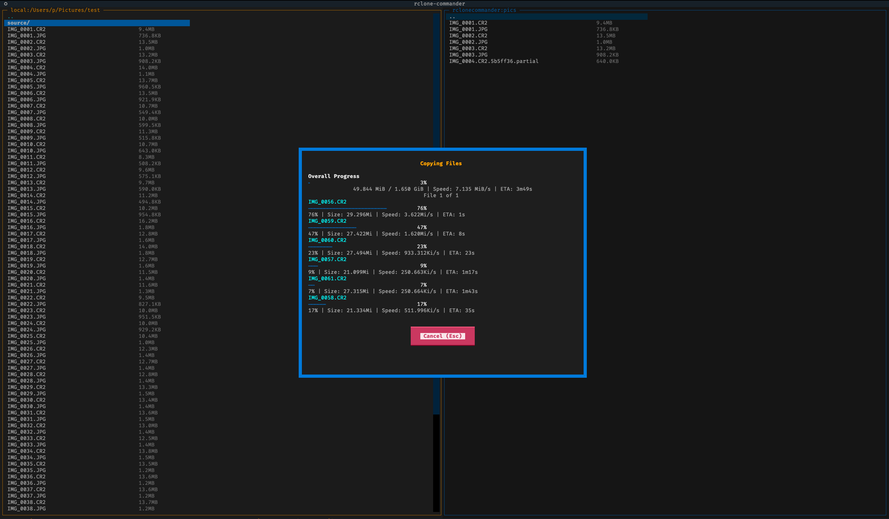

# rclone-commander

<p align="center">
  
</p>

A dual-pane TUI (Text User Interface) file manager for rclone.

## Features

- **Dual-pane interface** - Navigate two locations simultaneously
- **Parallel file transfers** - Transfer up to 6 files at once with individual progress bars
- **Real-time progress** - Global and per-file transfer statistics (bytes, speed, ETA)
- **Multi-select support** - Select multiple files/directories with Space or Insert
- **File operations** - Copy (F5), Move (F6), Delete (F8) with live progress tracking
- **Arrow key navigation** - Navigate directories with cursor memory
- **Smart features** - Auto-refresh, partial file cleanup, right-aligned file sizes
- **Color terminal support** - Rich colored interface with visual selection feedback
- **Fully configurable** - All settings, key bindings, and colors customizable
- **Remote support** - Works with all rclone remotes
- **Local filesystem support** - Unified local/remote access via rclone

## Installation

prerequisities:
- rclone installed and setup

```
pip install rclone-commander
```
or 
```
apt/brew/yum insall pipx
pipx install rclone-commander
```

## Configuration

rclone-commander includes a default configuration file bundled with the package. You can customize settings by creating your own config file.

**Config file locations** (in priority order):
1. `~/.config/rclone-commander/rclone-commander.ini` - User-specific config (recommended for customization)

### General Settings

```ini
[General]
# Default remote for left panel (leave empty for local)
default_left_remote =
# Default remote for right panel (leave empty for first from rclone.conf)
default_right_remote =
# Default starting path for local remote (leave empty for home directory, use / for root)
local_default_path =
# Application title
app_title = Rclone Commander
# Extra rclone flags for all operations
extra_rclone_flags = --transfers 6 --checkers 6
# Internal flag: whether user has been prompted about adding [local] remote (do not modify)
local_remote_prompted = false
```

**Default Panel Behavior:**
- **Left panel**: Defaults to `local` filesystem
- **Right panel**: Defaults to first remote from `rclone.conf`
- **Local starting path**:
  - Empty (`local_default_path =`) - Starts at user's home directory
  - Root (`local_default_path = /`) - Starts at filesystem root, allows browsing entire system
  - Custom (`local_default_path = /path/to/dir`) - Starts at specified directory

### Display Settings

```ini
[Display]
# Color scheme: dark, light, or auto
color_scheme = dark
# Show hidden files
show_hidden = true
# File size format: auto, bytes, KB, MB, GB
size_format = auto
# Border styles
border_style = solid
active_border_color = accent
inactive_border_color = primary
```

### Behavior Settings

```ini
[Behavior]
# Confirmation prompts
confirm_delete = true
confirm_overwrite = true
# Follow symbolic links
follow_symlinks = false
# Auto-refresh interval in seconds (0 to disable)
auto_refresh = 0
```

### Custom Key Bindings

```ini
[KeyBindings]
quit = q
switch_panel = tab
swap_panels = ctrl+u
copy = f5
move = f6
make_directory = f7
delete = f8,delete
navigate = enter
select_remote = f10
toggle_select = space,insert
refresh_panel = ctrl+r
show_dir_size = ctrl+i
```

## Navigation & Key Bindings

### Navigation Features

| Feature | Key/Action | Description |
|---------|-----------|-------------|
| **Cursor Movement** | Up/Down arrows | Move cursor one item at a time |
| **Fast Scroll** | Left/Right arrows | Scroll 1/2 screen at a time |
| **Open Directory** | Enter or Mouse click | Navigate into directories or open files |
| **Parent Directory** | Enter on ".." | Go to parent directory (cursor positions on previous directory) |
| **Panel Switch** | Tab | Switch focus between left and right panels |
| **File Selection** | Space or Insert | Toggle selection with inverted colors, auto-advance cursor |
| **Multi-Select** | Space/Insert (multiple) | Select multiple files before Copy/Move/Delete operations |
| **Root Navigation** | Enter on "/" | Local filesystem can navigate from root to browse entire system |
| **".." Entry** | Automatic | Always shown at top when not at root (hidden at "/" for local) |

### Selection Visual Indicators

| Item Type | Visual Style | Description |
|-----------|-------------|-------------|
| **Selected Directory** | Black text on blue background | Inverted colors for visibility |
| **Selected File** | Black text on white background | Inverted colors for visibility |
| **Filename Display** | Full filename visible | No marker characters that cut off filenames |
| **Auto-Clear** | After copy/move | Selections automatically cleared after successful operations |

### File Size Display

| Property | Value | Description |
|----------|-------|-------------|
| **Column Width** | 15 characters | Fixed width, right-aligned |
| **Content Alignment** | Left-aligned | File sizes displayed left-aligned within column |
| **Position** | Right edge of pane | Always visible and consistently positioned |
| **Format** | Human-readable | B, KB, MB, GB, TB, PB |

### Key Bindings

#### Function Keys (Primary Operations)

| Key | Operation | Description |
|-----|-----------|-------------|
| **F5** | Copy | Copy selected files to opposite panel (with progress bar) |
| **F6** | Move | Move selected files to opposite panel (with progress bar) |
| **F7** | Make Directory | Create new directory (cursor positions on created directory) |
| **F8** | Delete | Delete selected files (with progress bar) |
| **F10** | Select Remote | Show remote selection dialog (change current panel's remote) |
| **ESC** | Cancel | Cancel ongoing operation |

#### Navigation Keys

| Key | Action | Description |
|-----|--------|-------------|
| **Up/Down** | Cursor movement | Move cursor one item |
| **Left/Right** | Fast scroll | Scroll 1/2 screen at a time |
| **Enter** | Navigate | Open directory or navigate to parent (..) |
| **Tab** | Switch panel | Switch between left/right panels |
| **Space/Insert** | Toggle selection | Toggle file selection with inverted colors |
| **Mouse Click** | Navigate | Click on any row to navigate (same as Enter) |

#### Panel Operations

| Key | Operation | Description |
|-----|-----------|-------------|
| **Ctrl+U** | Swap Panels | Exchange left and right panel contents |
| **Ctrl+R** | Refresh Panel | Refresh current panel listing |
| **Ctrl+I** | Directory Size | Show size information for selected directory |

#### Application Control

| Key | Action | Description |
|-----|--------|-------------|
| **Q** | Quit | Exit application |

> **Note:** All key bindings are customizable in the `[KeyBindings]` section of `rclone-commander.ini`

## Rclone Configuration

The application reads from your rclone configuration file. By default, it looks for:
- `~/.config/rclone/rclone.conf`

You can override this with the `RCLONE_CONFIG` environment variable.

### Example rclone.conf:

```ini
[myremote]
type = sftp
host = example.com
user = username
port = 22

[backblaze]
type = b2
account = your_account_id
key = your_application_key

#local is necessary if you want to browse your local dirs
[local]
type = local

```

## Multi-Select Operations

1. Navigate to a file/directory
2. Press **Space** or **Insert** to select (inverted colors appear)
   - **Directories**: Black text on blue background
   - **Files**: Black text on white background
3. Navigate to more items and select them (cursor auto-advances)
4. Press **F5** (copy), **F6** (move), or **F8** (delete)
5. All selected items will be processed with real-time progress

If no items are selected, operations work on the currently highlighted item.

## Remote Selection

Press **F10** to open the remote selection dialog:
- Shows all available remotes from your rclone.conf
- Includes "local" for browsing local filesystem
- Centered modal dialog
- Navigate with arrow keys, press Enter to select
- Press Esc or Q to cancel

## Local Filesystem

The "local" remote uses rclone's `local` backend for unified operation handling. This provides:
- Consistent behavior across local and remote operations
- Same progress tracking for all transfers
- Unified path handling and error reporting
- Full filesystem access - can navigate from root (/) to browse entire system
- Configurable starting directory (home, root, or custom path)

Configure in `~/.config/rclone/rclone.conf`:
```ini
[local]
type = local
```

By default, the local remote starts at your home directory. To start at the filesystem root (/) or a custom directory, set `local_default_path` in `config/rclone-commander.ini`.

## Environment Variables

- `RCLONE_CONFIG` - Path to rclone configuration file
- `RCLONE_PATH` - Path to rclone executable (default: `rclone`)

## License

This project is licensed under the GNU General Public License v3.0 - see the [LICENSE](LICENSE) file for details.

## Changelog

### Version 0.1.3 (2025-11-24)
- Rename app_config.ini to rclone-commander.ini
- Offer to add the [local] section to the rclone.conf upon the first run

### Version 0.1.2
- Add Makefile for build automation with venv support
- Enhance .gitignore with comprehensive build artifact coverage
- All build commands use isolated virtual environment

### Version 0.1.1
- Restructure config to be bundled with package
- Config search priority: user config → package config → legacy
- Change license from MIT to GPLv3
- Add GPLv3 headers to all source files
- Add configurable `local_default_path` option
- Clear selections after successful copy/move operations
- Improve file size column (15-char width, left-aligned)
- Enable full filesystem browsing from root (/) for local remote
- Proper root directory handling (hide ".." at "/")
- Update all offset calculations for root navigation
- Config ships with pip install (no manual setup needed)

### Version 0.1.0
- Initial release
- Dual-pane file browser with rclone integration
- Local and remote filesystem support
- Multi-file selection with visual feedback
- Copy/Move/Delete with real-time progress tracking
- Parallel file transfers (up to 6 files simultaneously)
- Mouse support for navigation
- Configuration file support

## Credits

Built with:
- [Textual](https://github.com/Textualize/textual) - Modern TUI framework
- [rclone](https://rclone.org/) - Cloud storage sync tool
